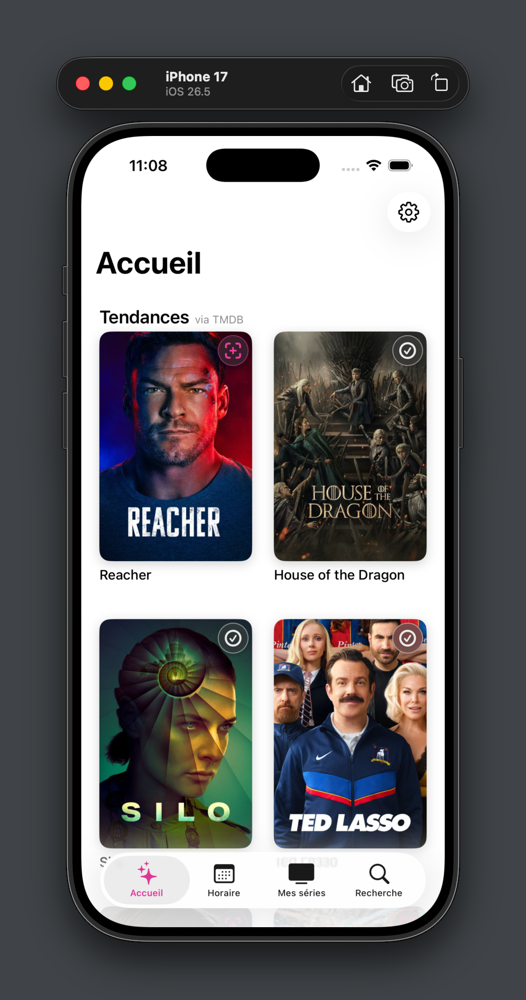
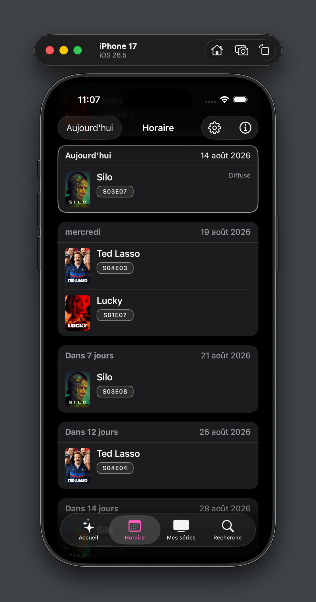
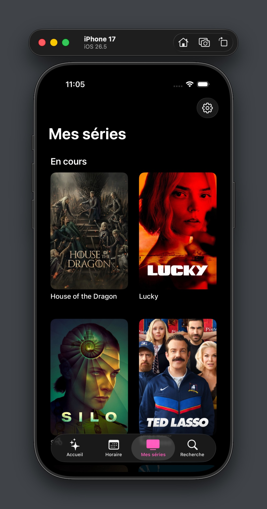
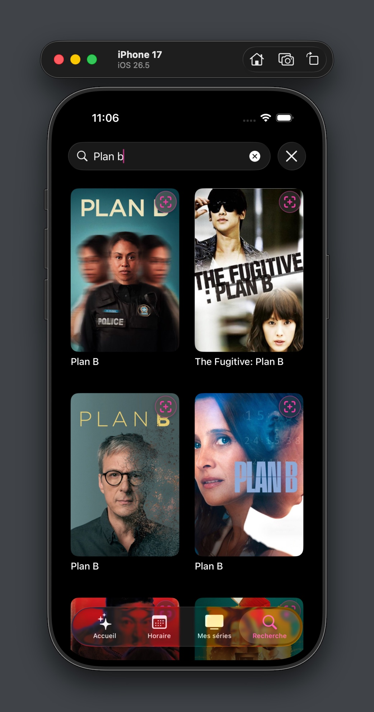
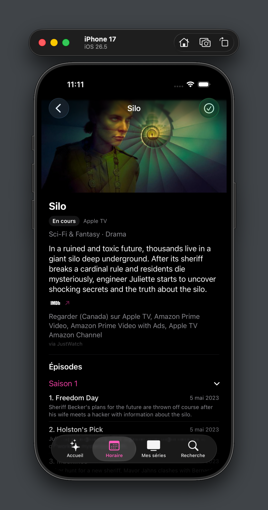
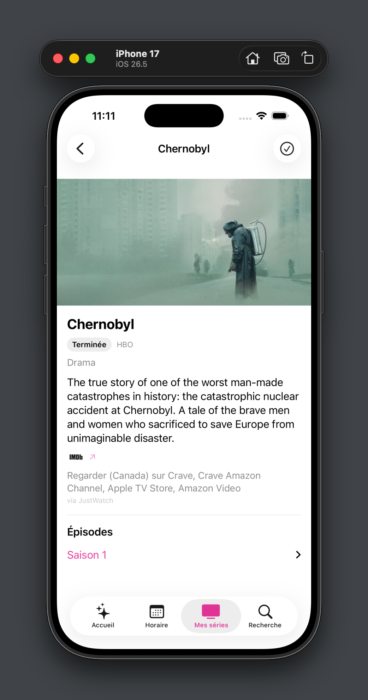

# tvQ

Application iOS (SwiftUI) pour suivre l'horaire de diffusion des séries télé qu'on suit, savoir où les regarder, et ne rien manquer.

> Ce README est mis à jour au fur et à mesure du développement — il reflète l'état du projet à la date indiquée en fin de fichier, pas nécessairement l'état futur.

## Aperçu

| Accueil | Horaire | Mes séries |
|---|---|---|
|  |  |  |

| Recherche | Fiche série (sombre) | Fiche série (clair) |
|---|---|---|
|  |  |  |

## Stack technique

- **UI** : SwiftUI
- **Auth** : Firebase Auth (Sign in with Apple)
- **Base de données** : Firestore (cache partagé séries/épisodes, liste des séries suivies)
- **Données séries** : [TMDB](https://www.themoviedb.org/) (métadonnées séries/épisodes)
- **Où regarder** : [JustWatch](https://www.justwatch.com/) (via TMDB `watch/providers`)
- **Architecture** : Clean Architecture — séparation en 4 couches :
  - `Domain/` — entités et cas d'usage, indépendants de toute techno
  - `Data/` — repositories, réseau (TMDB, Firestore), mappers, persistance locale
  - `Core/` — injection de dépendances, auth, réseau bas niveau, cache, settings, utilitaires
  - `Presentation/` — vues SwiftUI et view models

## État des fonctionnalités

### Fait

- Horaire "À venir" avec cache à 3 paliers (local disque → Firestore partagé → TMDB/TVmaze)
- Fiche série (`ShowDetailView`) avec liste des épisodes, même cache à 3 paliers
- Suivi/retrait de séries (follow/unfollow), résolution en parallèle des séries suivies
- Sign in with Apple
- "Où regarder" par pays (CA/US/FR/GB) via TMDB + JustWatch, avec fusion des doublons de catalogue (ex. Disney Plus/Disney+)
- Logo et identité visuelle de base

### Pas commencé / en réflexion

- Look de l'app (couleurs, typographie, ambiance générale) — pas encore défini
- Page "Tendances" (séries les plus suivies) — demande une agrégation des follows, design à faire
- Déverrouillage biométrique automatique (Face ID au lancement, façon Tangerine)
- Rafraîchissement à chaud de la langue de contenu TMDB (actuellement il faut relancer l'app après un changement dans Settings)
- Monétisation — **bloquée probablement** par les conditions commerciales de TMDB et JustWatch, voir `BACKLOG.md` pour le détail

Le détail complet (raisonnement, dates, décisions techniques) est dans `BACKLOG.md`.

## Structure du projet

```
tvQ/
├── Core/            # DI, Auth, Networking, Caching, Settings, Extensions, Utilities
├── Data/             # Network, Repositories, Mappers, Persistence
├── Domain/           # Entities, Repositories (protocoles), UseCases
├── Presentation/      # Views, ViewModels
├── Config/
└── Assets.xcassets/
```

---
*Dernière mise à jour : 2026-07-20*
